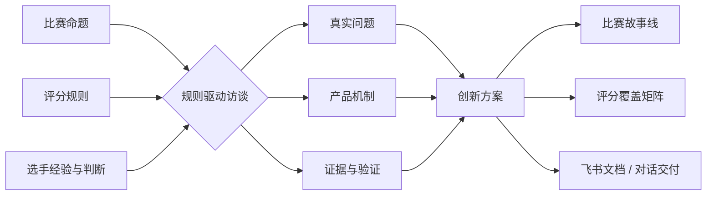
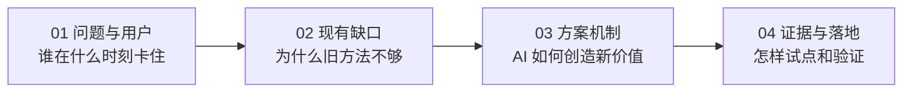
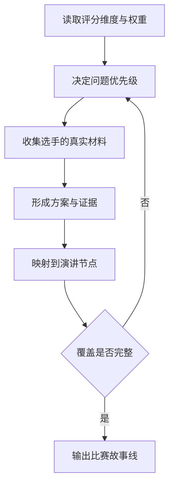
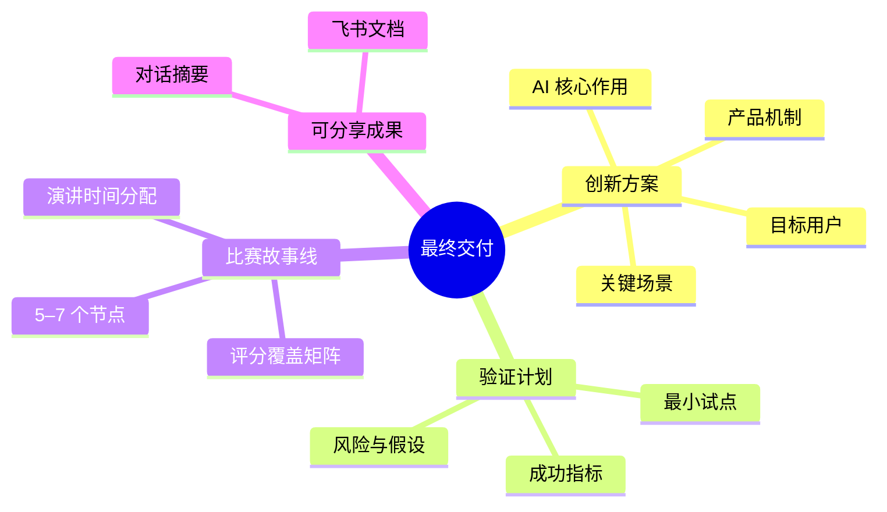
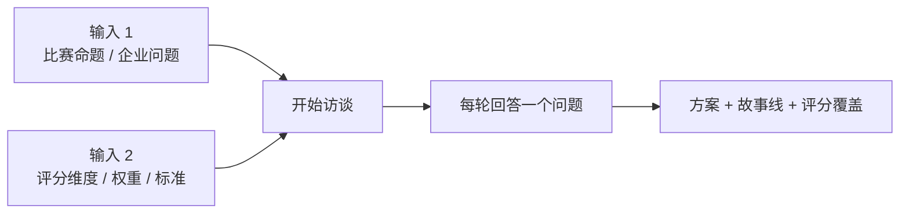

# Competition Storyline Coach

> 把「比赛命题 + 评分规则 + 选手经验」转化为「可验证的创新方案 + 能拿分的演讲故事线」。


这是一套平台无关的比赛思考工作流。它以 `SKILL.md` 为核心，可用于**豆包工作**，也可迁移到其他支持自定义 Skill、智能体指令或项目规则的 AI 平台。



## 它解决什么

| 比赛中的常见状态 | 这套 Skill 的作用 | 最终形成 |
|---|---|---|
| 有表达欲，但想法散乱 | 用有限问题找到核心矛盾 | 一句话问题定义 |
| 有创意，但和评分标准脱节 | 把每项权重转成探索重点 | 评分覆盖矩阵 |
| 会讲功能，不会讲价值 | 追问用户、场景、机制与结果 | 完整产品逻辑 |
| 有方案，但缺少可信证据 | 区分事实、判断和待验证假设 | 最小试点与指标 |
| 害怕临场表达 | 把复杂内容压缩成可讲述节点 | 5–7 节点故事线 |

## 工作方式

### 一次访谈，四个阶段



标准模式通常为 **5–7 个主问题 / 10–15 分钟**。每轮只问一个主要问题，并持续显示进度：

```text
问题定位 ✓  →  现有缺口 ✓  →  方案机制 ●  →  验证落地 ○
███████░░░ 70%｜第 5/7 问｜预计还需 3–5 分钟
```

任何时候回复“先总结”，都可以停止访谈并获得阶段性成果与信息缺口。

### 评分规则不是检查清单，而是故事线的路由器



| 评分维度 | 访谈重点 | 演讲中的可见证据 |
|---|---|---|
| 创新性 | 问题切口、AI 的不可替代性 | 与常规方案的关键差异 |
| 应用深度 | 是否进入核心业务链路 | Agent / 工作流及关键决策点 |
| 业务价值 | 真实痛点和量化收益 | 效率、成本、质量或收入指标 |
| 完整性与落地 | 闭环、试点、迭代和推广 | MVP、验证方法与风险边界 |
| 现场表达 | 结构、节奏和角色分工 | 5–7 节点故事线与时间分配 |

> 上表只展示映射方式。实际访谈始终以用户提供的本届评分规则为准，不套用示例权重。

## 你会得到什么



## 在不同平台使用

| 平台 | 推荐方式 | 兼容说明 |
|---|---|---|
| **豆包工作** | 下载 ZIP，在“技能”入口上传自定义技能 | 优先适配；若当前版本不支持 ZIP，可上传 `SKILL.md` 并保留 `references/` |
| Codex | 使用下方一句话安装脚本 | 可自动发现并通过 `$competition-storyline-coach` 显式触发 |
| WorkBuddy / 其他 Skill 平台 | 将完整技能目录放入平台的 skills 目录 | 核心访谈与交付逻辑兼容，工具名称由平台自行映射 |
| 通用 AI 智能体 | 将 `SKILL.md` 与所需 references 作为项目指令 | 可使用核心方法；自动建飞书文档取决于平台是否具备对应工具和权限 |

> 不同版本的产品入口可能变化，但兼容性的核心不是某个按钮，而是平台能够读取 `SKILL.md` 及其相对路径引用。

### 豆包工作：推荐安装

1. 下载 [`competition-storyline-coach-v1.0.0.zip`](https://github.com/irisivy7421-ux/competition-storyline-coach/raw/v1.0.0/release/competition-storyline-coach-v1.0.0.zip)。
2. 在豆包工作的技能入口选择上传自定义技能。
3. 上传 ZIP；如果当前版本只接受单文件，则先上传 `SKILL.md`，再补充 `references/` 中的文件。
4. 新建对话，用下方模板开始。

### Codex：一句话安装

```bash
python3 "${CODEX_HOME:-$HOME/.codex}/skills/.system/skill-installer/scripts/install-skill-from-github.py" --repo irisivy7421-ux/competition-storyline-coach --ref v1.0.0 --path competition-storyline-coach
```

安装器不会覆盖已有同名目录。升级前请先备份旧版本。

### 其他平台：读取核心指令

如果平台不能直接导入 ZIP，可以让智能体读取：

```text
https://raw.githubusercontent.com/irisivy7421-ux/competition-storyline-coach/main/competition-storyline-coach/SKILL.md
```

同时保留 `references/` 目录，才能获得完整的进度卡、提问方式与交付模板。

## 30 秒开始

先准备两类输入：



把下面内容发给已经加载该 Skill 的智能体：

```text
请使用 competition-storyline-coach。

比赛命题：
【粘贴企业介绍与比赛问题】

评分规则：
【粘贴文字、表格，或上传图片/PDF】

请使用标准模式访谈，显示进度卡。
完成后交付方案摘要、比赛故事线和飞书文档。
```

如果缺少命题或评分规则，Skill 会先要求补齐，不会直接生成一份看似完整但无法对应比赛的通用方案。

## 证据边界

| 状态 | 含义 | 写作规则 |
|---|---|---|
| ✅ 已确认 | 来自正式规则、用户材料或可核验来源 | 可作为事实陈述 |
| 💡 方案判断 | 根据访谈推导出的设计结论 | 明确标注为方案选择 |
| 🧪 待验证 | 尚无用户、数据或主办方确认 | 进入试点与验证清单 |

Skill 不会把产品设想写成已验证效果，也不会编造访谈、业务收益、推广数据或原创性证据。

## 文件结构

<details>
<summary>展开查看</summary>

```text
competition-storyline-coach/
├── SKILL.md
├── agents/
│   └── openai.yaml
└── references/
    ├── example-rubric.md
    └── interaction-and-delivery.md
```

- `SKILL.md`：平台无关的核心工作流与判断规则。
- `references/interaction-and-delivery.md`：进度卡、提问卡和交付模板。
- `references/example-rubric.md`：用于测试规则校验能力的示例，不是默认评分标准。
- `agents/openai.yaml`：部分 OpenAI 系平台可读取的可选界面元数据，不影响其他平台使用核心 Skill。

</details>

## 数据与权限

- Skill 本身不包含飞书凭证、平台令牌、内部链接或真实学生数据。
- 创建飞书文档依赖当前平台可用的飞书工具、用户认证与文档权限。
- 默认新建交付文档，不覆盖已有文档。
- 比赛材料可能包含企业内部信息；上传公开服务前，请先确认公开边界。

## Release

- [v1.0.0](https://github.com/irisivy7421-ux/competition-storyline-coach/releases/tag/v1.0.0)：规则校验、可视化访谈、方案与故事线交付、飞书文档模板。

## License

[MIT License](LICENSE)
